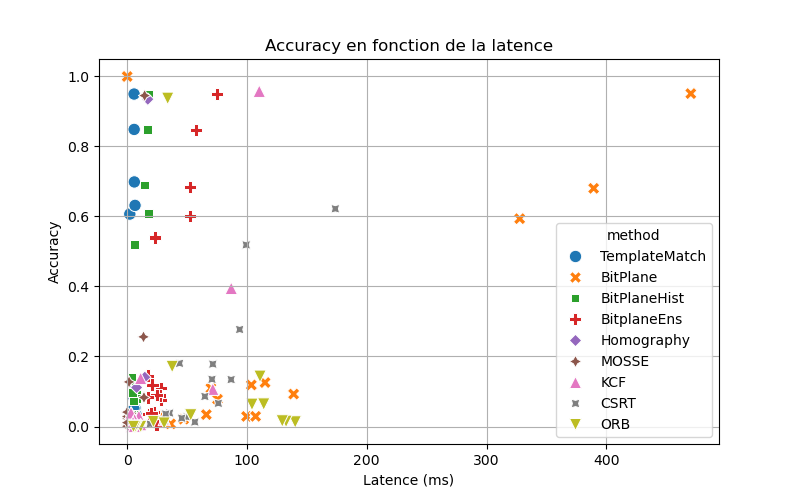

# BCOD: Benchmarking Custom Object Detectors

**BCOD** is a lightweight, modularbenchmarking framework designed to compare various object tracking algorithms using a common interface. The repository provides a common interface so different trackers can be plugged in and measured reproducibly for accuracy, speed and latency
This repository focuses on classical, handcrafted tracking methods as well as template and feature-based approaches, allowing for reproducible evaluation on video sequences with ground truth annotations
By design i don't explore heavy convolutional neural networks (CNNs) in this repository : the primary goal is to run the algorithms on resource-constrained, embedded systems (for example ESP32 and other microcontrollers)

## 📁 Project Structure

```
BCOD/
├── main.py            
├── benchmark.py               # Main benchmarking script (parallelized)
├── evaluate.py                # Evaluation script for metrics computation
├── extract_from_dataset.py    # Extracts sequences from dataset
├── download_dataset.py        # Downloads benchmark dataset
├── YTBBLoader.py              # YouTube Bounding Box dataset loader
├── utils.py                   # Utility functions for bitplane extraction and computing 
├── methods/                   # Tracking method implementations
│   ├── base.py                # Abstract base tracker interface
│   ├── template_match.py      # Template matching tracker
│   ├── bitplane.py            # Bit-plane logic tracker
│   ├── bitplane_hist.py       # Bit-plane histogram tracker
│   ├── bitplane_ens.py        # Bit-plane ensemble tracker
│   ├── homography.py          # ORB+Homography based tracking
│   ├── opencv_trackers.py     # Wrapper for OpenCV MOSSE, KCF, CSRT
│   └── orb_tracker.py         # ORB feature-matching based tracker
```

---

## Tracker Implementations : Algorithms Overview

Each tracker inherits from a common interface defined in `base.py`, and implements an `update()` method returning the bounding box on the current frame

### Template Matching Tracker

This method uses OpenCV’s `matchTemplate` to locate a region of interest (ROI) from the initial frame in subsequent frames 
The selected ROI is converted to grayscale and stored as a reference template  
For each new frame, the method scans the entire image, comparing the template to every possible position and returning the location with the highest similarity score (default: `cv2.TM_CCOEFF_NORMED`)
It is lightweight and simple but sensitive to scale, rotation, and lighting changes

### Bitplane Tracker

This approach relies on the binary decomposition of image intensity values, where each pixel is represented as a set of bitplanes corresponding to its binary form. By isolating these bitplanes, the method can focus on the most informative bits for object representation. During tracking, logical operations are performed between the bitplanes of the initially selected region of interest (ROI) and those extracted from each new frame. This strategy makes the tracker resilient to gradual lighting variations, low-frequency noise, and shadows, as the higher-order bitplanes tend to capture the essential structure of the object. However, because the method compares fixed binary patterns, it is inherently sensitive to changes in the object’s orientation, rotation, or scale, which can cause mismatches between the stored bitplanes and the current appearance of the target
### Bitplane Histogram Tracker

The Bitplane Histogram Tracker combines binary bitplane analysis with histogram comparison to locate a target region in successive video frames. When first initialized, the method extracts the most significant bitplanes—specifically bitplanes 6 and 7—from the grayscale representation of the target template, and computes a weighted intensity histogram. Tracking proceeds in two stages. In the coarse stage, the search region is defined around the last known position, and the most significant bitplane (bitplane 7) is matched against the template at multiple pyramid scales using OpenCV’s matchTemplate. This produces a ranked list of candidate positions. In the fine evaluation stage, each candidate region is compared to the template using a custom similarity measure: a “psi” score computed from logical agreement of the two bitplanes, combined with the correlation between their weighted histograms. Small in-plane rotations are also tested to improve robustness against slight orientation changes. By combining structural information from high-order bitplanes with statistical intensity distribution, this tracker offers strong resistance to low-frequency illumination changes and soft shadows, while remaining lightweight enough for real-time operation. However, like most template-based approaches, it can be sensitive to significant scale changes or large rotations

### Bitplane Ensemble Tracker
The Bitplane-based Logical Tracker operates on the principle of binary decomposition of pixel intensities, breaking an image down into its individual bitplanes. At initialization, it isolates the most significant bitplanes from the target region of interest and stores them as the reference pattern. For each new frame, the same decomposition is applied to the search area, and logical operations—such as AND, OR, and XOR—are used to measure similarity between the reference and candidate regions. This binary representation filters out low-frequency intensity variations, making the method naturally resilient to changes in illumination, soft shadows, and mild image noise. By focusing on the high-order bits, it captures the structural essence of the object while ignoring gradual shading. The approach is computationally lightweight, well-suited for embedded systems with limited processing power, but its reliance on pixel alignment makes it less tolerant to significant rotation or scale variations


### Homography-Based Tracker    

The Homography-based tracker leverages local feature matching to maintain object localization even under complex geometric transformations. At initialization, the region of interest is extracted from the first frame, converted to grayscale, and processed with the ORB (Oriented FAST and Rotated BRIEF) detector to extract keypoints and descriptors. These descriptors form the visual fingerprint of the template. For each new frame, the same feature extraction is applied, and a brute-force Hamming matcher identifies correspondences between the template and the current scene. A ratio test filters out ambiguous matches, ensuring that only high-confidence correspondences are kept. If enough reliable matches are found, their spatial relationship is used to compute a homography matrix via RANSAC, which models the full perspective transformation between the template and its current position in the frame. This transformation is then applied to the template’s corner points to project its new outline in the scene, producing a robust bounding box. By relying on feature geometry rather than raw pixel similarity, this method can handle scale changes, rotations, and moderate viewpoint shifts. However, it is more computationally demanding than simple template matching and may struggle when the tracked object has few distinctive features or is heavily motion-blurred
### MOSSE Tracker

A fast adaptive correlation tracker using Minimum Output Sum of Squared Error filters, originally proposed for real-time applications. It adapts the filter in real-time, allowing robust tracking under partial occlusion or lighting variation. Very lightweight but may drift over time

### KCF Tracker

Kernelized Correlation Filters are more accurate than MOSSE, using circulant matrix formulations and kernel tricks (Gaussian or polynomial). It models object appearance with higher discriminative power and can handle moderate deformation

### CSRT Tracker

The Discriminative Correlation Filter with Channel and Spatial Reliability (CSRT) tracker improves over KCF by learning a spatial reliability map and using multiple feature channels. More accurate under scale change and deformation, but computationally heavier

### ORB Tracker

The ORB tracker is a feature-based tracking approach that uses Oriented FAST and Rotated BRIEF to identify and match distinctive points between a reference template and incoming video frames. At initialization, the tracker extracts a region of interest and computes its ORB keypoints and descriptors. For each new frame, it detects keypoints in the scene and matches them to the template using a Hamming-distance brute-force matcher. The resulting matches are used to estimate a homography between the template and the current frame, allowing the tracker to project the original bounding box into the new position. This method is robust to changes in scale, rotation, and partial viewpoint shifts, but its performance depends on the quality and quantity of distinctive features in the object, and it may degrade in low-texture regions or under heavy motion blur

---

## Main
The main class provides object detection and tracking from video files or webcam streams.
### Key Features
- Object detection using background subtraction (MOG2) to localize moving objects.
- Robust multi-scale and multi-angle tracking via the OptimizedTracker class, based on bit-plane extraction and weighted histograms for matching.
- Supports tracking initialization by user input (e.g., mouse selection of ROI) and automatic updates.
- Handles rotated bounding boxes and smoothes orientation estimation using angle history.
- Designed for real-time performance with frame skipping and optimized computations.
- Configurable parameters for detection sensitivity, frame resolution, and tracking thresholds.

---

## Dataset

Benchmark videos cames from https://research.google.com/youtube-bb/ and are stored in `yt/videos`, each paired with a ground truth file in `ytbb_subset.csv`, formatted as CSV:

```
youtube_id,timestamp_ms,class_id,class_name,object_id,object_presence,xmin,xmax,ymin,ymax
FcmfoPqPxB8,0,0,person,0,present,0.21,0.686,0.0,1.0
...
```

---

## Evaluation Metrics

Trackers are evaluated based on:

Tracker performance is assessed using two main criteria:

- **Frames Per Second (FPS)** — Measures processing speed, indicating how many frames the tracker can handle per second
- **Latency (ms)** — The inverse of FPS, showing average processing time per frame
- **Accuracy** — is evaluated using the **mean Intersection over Union (IoU)** between the predicted bounding box and the ground truth across all frames

---

## Usage

### Benchmarking All Methods

```bash
python benchmark.py
```

This will run each tracker on all videos in parallel, saving logs and output video
you can display the tracked bounding boxes on the video frames by turning SHOW_PREVIEW variable to `True` in `benchmark.py`

### Analyse Results
I evaluated the performance of all the object tracking/detection methods across 10 videos
Below you can find a graph that is a summary of the results:

**BitPlaneHist and BitplaneEns** stand out as **more stable and reliable methods**, providing a better balance between accuracy and latency.
They maintain solid average accuracies (~26%) close to BitPlane’s peak levels but with much lower latency (~8 ms and ~31 ms respectively) and more consistent FPS.
This suggests that these enhanced BitPlane variants improve robustness while keeping computational cost manageable, making them practical for real-time or near-real-time applications.

**TemplateMatch** offers a **competitive accuracy** close to BitPlaneHist **with similar latency** (~6 ms), positioning it as a **good baseline for speed-accuracy trade-off**.

**BitPlane** achieves the highest **peak accuracies with extraordinary FPS**, but its results fluctuate strongly between videos, reflecting potential **instability** or sensitivity to video content or noise. Its very high latency in some cases also indicates inconsistency.

Classical trackers like **KCF** and **MOSSE** provide **lower average accuracy** but extremely low latency and very high FPS, suitable when speed is critical and some loss of accuracy is acceptable.
Methods such as **CSRT, ORB, and Homography** show moderate to **low accuracy and varying latencies**, potentially suited for specialized scenarios or as complementary approaches.

---
